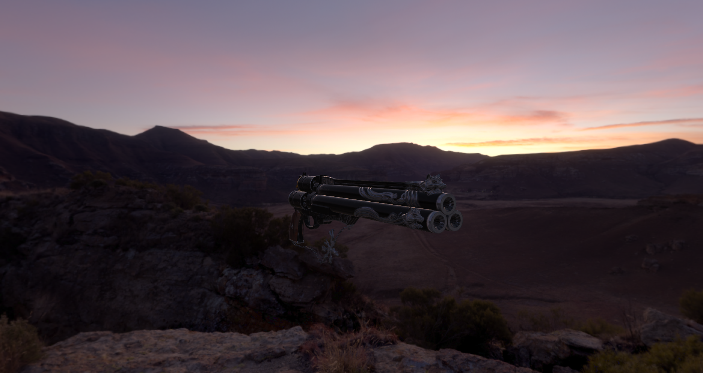

<h1 align="center">
  Rose
</h1>

<h3 align="center">
A Vulkan renderer library created in C++.
</h3>


<p align="center">
  <a href="#how-to-setup">How to setup</a>
  |
  <a href="#platform-support">Platform support</a>
  |
  <a href="#features">Features</a>
  |
  <a href="#personal-goal">Personal Goal</a>
</p>
  
  
<p align="center">
<a href="#">
</p>


How to setup
-------------
  
**This codebase has not been compiled on other compilers such as GCC or Clang nor has it been tested on other IDEs**
<br>
Visual studio is recommended preferably version 2019 since this project was developed for that IDE...Although you can change the .bat file to generate 2022 solution files.
<br>
<br>
To generate the solution files, go to:
```
scripts/Win_BuildProj.bat
```


In order to build a visual studio 2022 solution you will need to edit the .bat file from:
```
@echo off
pushd %~dp0\..\
call vendor\bin\premake5.exe vs2019
popd
PAUSE
```

to:
```
@echo off
pushd %~dp0\..\
call vendor\bin\premake5.exe vs2022
popd
PAUSE
```

In order to build this project make sure to:
```
  - That the startup project is Sandbox application.
```
Everything should build properly.
 

## Platform support
| Windows 11 | Windows 10-64bit | Mac | Linux |
| --- | --- | --- | --- |
| :grey_question: | :heavy_check_mark: | :x: | :x: |

<blockquote>
I'm not sure if going to support Mac and Linux. I currently do not have Windows 11 so I cannot verify if this project would compile on that OS
</blockquote>

## GPU support
| AMD | Nvidia | Intel |
| --- | --- | --- |
| :heavy_check_mark: | :grey_question: | :grey_question: |
<blockquote>
I do not have access to a Nvidia GPU and an Intel GPU that supports Vulkan so I cannot verify how stable builds that use those GPUs will be.
</blockquote>
 
## Features
* Uses VMA
* Most buffers are implemented
* Textures and Cubemaps
* Can load models
* A PBR+IBL enviorment

## Personal Goal
Rose was made to educate myself about Vulkan and how it works. I've always wanted to learn Vulkan in my spare time but never had the chance to learn it until now. I wanted to know the API while also trying and implement some modern techniques used within the gaming industry. This library only has a basic forward renderer, but hopefully, in the future, I hope to experiment with clustered rendering, implementing different shadow algorithms, reflections, post processing and more. I'm not sure if this repository will use ray tracing in the future since I do not have a ray tracing compatible card.
